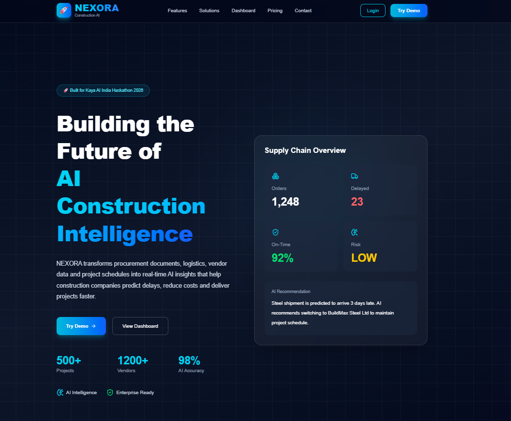
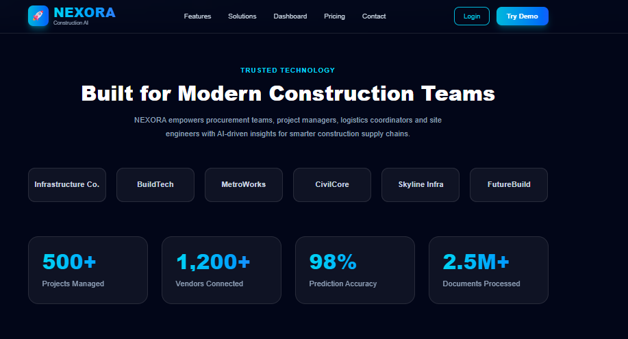
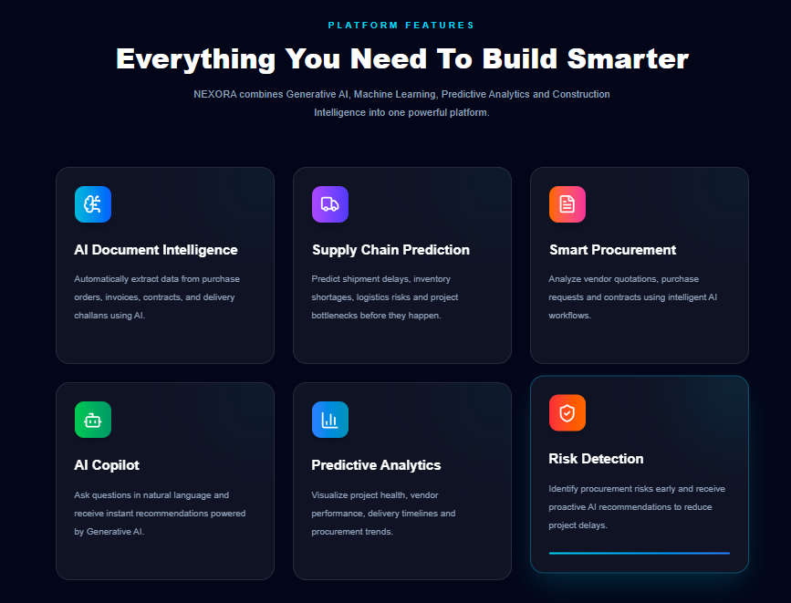
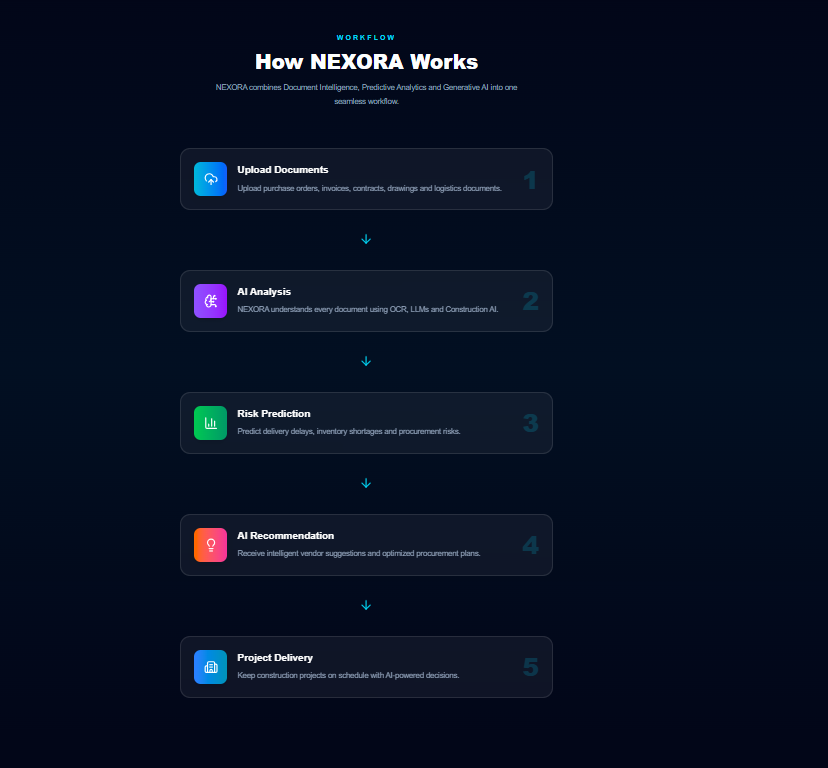
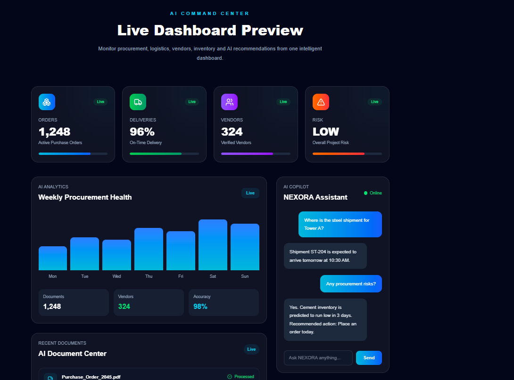
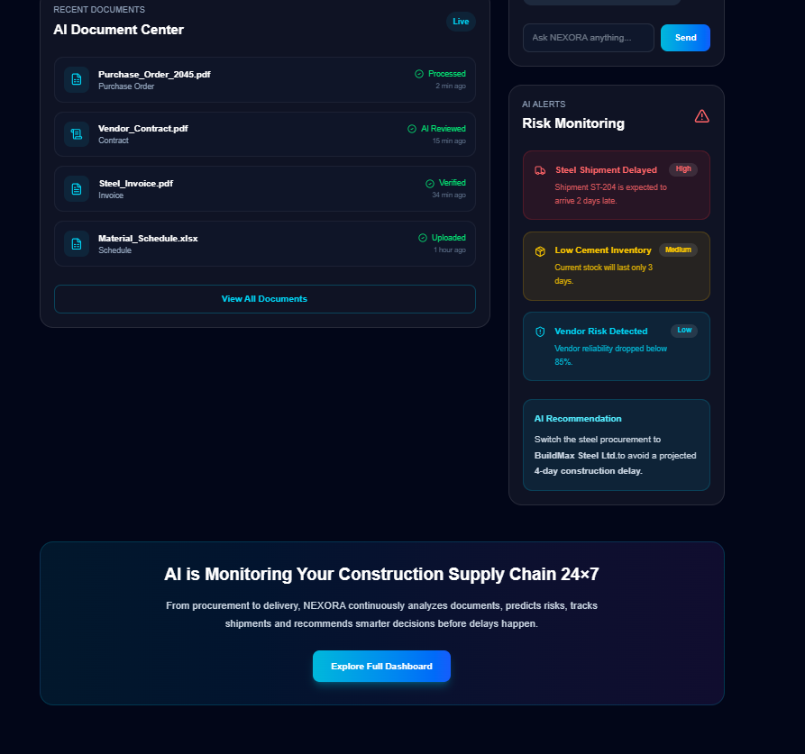
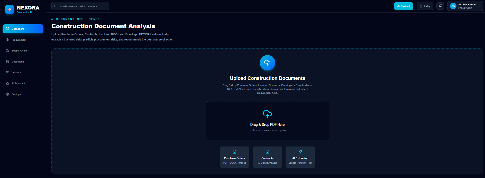
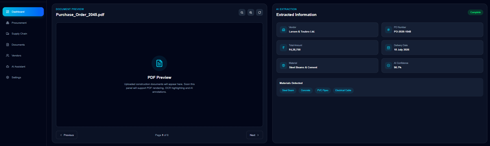
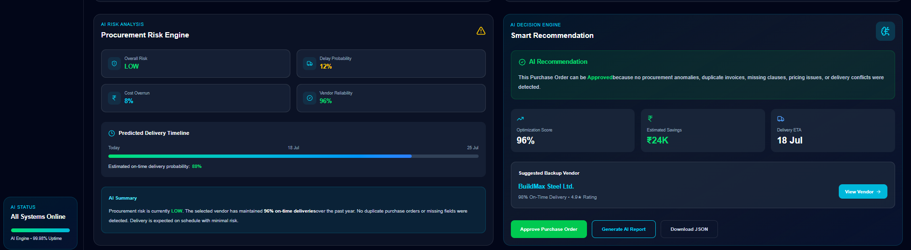

# 🚀 NEXORA

<p align="center">

# AI-Powered Construction Procurement & Supply Chain Intelligence Platform

Built for **Kaya AI India Hackathon 2026**


</p>

---

# 🌍 Overview

NEXORA is an AI-powered Construction Procurement & Supply Chain Intelligence Platform designed to simplify project procurement through AI.

Instead of manually reviewing purchase orders, invoices, quotations, vendor documents, delivery schedules and contracts, NEXORA automatically extracts information, predicts procurement risks, recommends vendors and provides an intelligent dashboard for project managers.

The platform combines

- 🤖 Artificial Intelligence
- 📄 OCR Document Processing
- 📊 Predictive Analytics
- 🚚 Supply Chain Intelligence
- 🧠 AI Copilot
- 📈 Procurement Dashboard

into one modern construction intelligence platform.

---

# ✨ Features

- ✅ AI Document Intelligence
- ✅ OCR Document Parsing
- ✅ Procurement Intelligence
- ✅ Vendor Recommendation Engine
- ✅ Supply Chain Monitoring
- ✅ AI Risk Prediction
- ✅ Construction Analytics Dashboard
- ✅ AI Copilot Assistant
- ✅ Smart Recommendation Engine
- ✅ Live KPI Dashboard
- ✅ Procurement Risk Analysis
- ✅ Document Upload & Analysis
- ✅ Vendor Intelligence
- ✅ Real-time Analytics

---

# 📸 Project Screenshots

## 🚀 Landing Page



---

## 📊 Trusted Construction Companies



---

## ✨ Platform Features



---

## ⚙ Workflow



---

## 📈 Live Dashboard



---

## 🤖 AI Analytics Dashboard



---

## 📄 AI Document Upload



---

## 🧠 AI Document Intelligence



---

## 💡 Procurement Intelligence



---

# 🏗 System Architecture


---

# 🧠 How It Works

```
Upload Documents
        │
        ▼
OCR + AI Extraction
        │
        ▼
Vendor Analysis
        │
        ▼
Risk Prediction
        │
        ▼
Recommendation Engine
        │
        ▼
Construction Dashboard
```

---

# 🛠 Tech Stack

## Frontend

- React 19
- TypeScript
- Vite
- Tailwind CSS
- Lucide React

## Backend (Planned)

- Flask
- Python
- REST API

## AI Modules

- OCR
- LLM
- RAG
- Predictive Analytics
- Procurement Intelligence
- Recommendation Engine

---

# 📂 Project Structure

```
src
│
├── assets
├── components
├── hooks
├── layouts
├── pages
├── services
├── styles
├── types
├── utils
│
├── App.tsx
├── main.tsx
└── index.css

docs
│
├── architecture.png
├── dashboard_01.png
├── dashboard_02.png
├── document-analysis_01.png
├── document-analysis_02.png
├── document-analysis_03.png
├── landing_01.png
├── landing_02.png
├── landing_03.png
└── landing_04.png
```

---

# 🚀 Installation

Clone the repository

```bash
git clone https://github.com/mrashish18/NEXORA.git
```

Move into project

```bash
cd NEXORA
```

Install dependencies

```bash
npm install
```

Start development server

```bash
npm run dev
```

Build

```bash
npm run build
```

---

# 🚀 Future Roadmap

- AI Contract Review
- Vendor Scoring
- ERP Integration
- BIM Integration
- AI Chat Assistant
- Predictive Cost Analysis
- Invoice Fraud Detection
- Live Project Monitoring
- Construction Digital Twin
- Mobile Application

---

# 👨‍💻 Author

**Ashish Kumar**

IIT Madras BS Degree Program

GitHub

https://github.com/mrashish18

---

# ⭐ Built For

**Kaya AI India Hackathon 2026**

---

# 📜 License

This project is licensed under the MIT License.

---

## ⭐ If you like this project, consider giving it a Star!