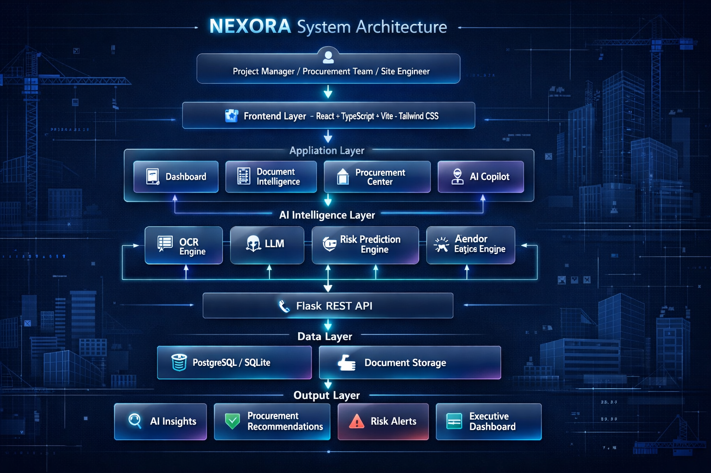

# 🚀 NEXORA

<p align="center">

AI-Powered Construction Procurement & Supply Chain Intelligence Platform

Built for **Kaya AI India Hackathon 2026**

</p>

---

## 📸 Preview

<p align="center">


</p>

---

# 🌍 Overview

NEXORA is an AI-powered construction intelligence platform that transforms procurement, supply chain management, and document analysis into one intelligent workflow.

Instead of manually reviewing purchase orders, contracts, invoices, quotations, and vendor documents, NEXORA automatically extracts data, predicts procurement risks, recommends vendors, and assists project managers using AI.

---

# ✨ Features

✅ AI Document Intelligence

✅ OCR + Document Parsing

✅ Procurement Intelligence

✅ Vendor Recommendation Engine

✅ Supply Chain Monitoring

✅ AI Risk Prediction

✅ Construction Analytics Dashboard

✅ AI Copilot Assistant

---

# 📊 Screenshots

## Landing Page


---

## Dashboard


---

## Document Intelligence


---

## Procurement Intelligence


---

# 🏗 Architecture



---

# ⚙ Tech Stack

### Frontend

- React
- TypeScript
- Vite
- Tailwind CSS
- Lucide React

### Backend (Planned)

- Flask
- Python

### AI

- OCR
- LLM
- RAG
- Document Intelligence
- Predictive Analytics

---

# 🚀 Future Roadmap

- AI Contract Review
- Construction Supply Chain Prediction
- Vendor Scoring Engine
- AI Procurement Assistant
- Live Project Dashboard
- ERP Integration

---

# 📂 Project Structure

```text
src
 ├── components
 ├── layouts
 ├── pages
 ├── services
 ├── styles
 ├── hooks
 ├── utils
 └── assets
```

---

# 👨‍💻 Author

Ashish Kumar

IIT Madras BS Degree Program

---

# ⭐ Built for

Kaya AI India Hackathon 2026


