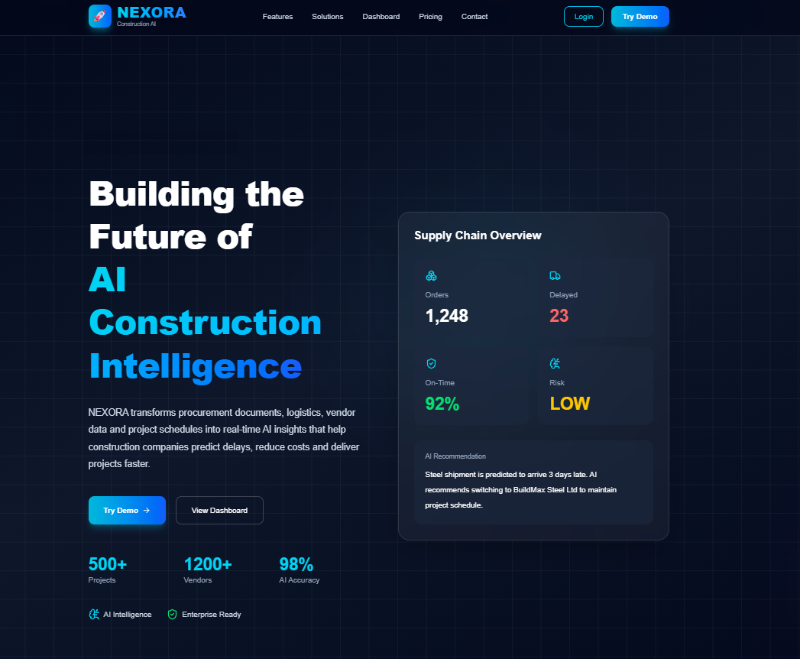
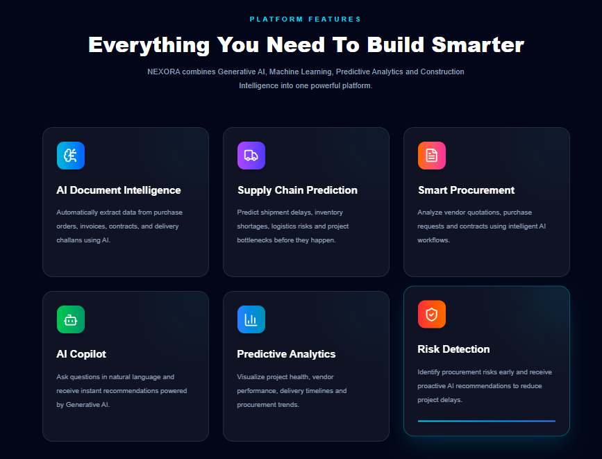
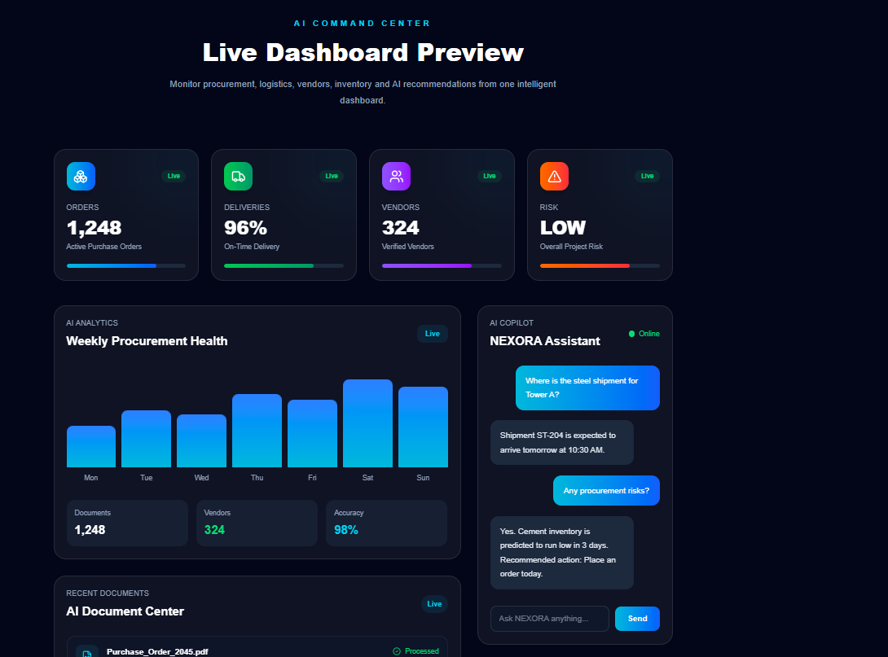
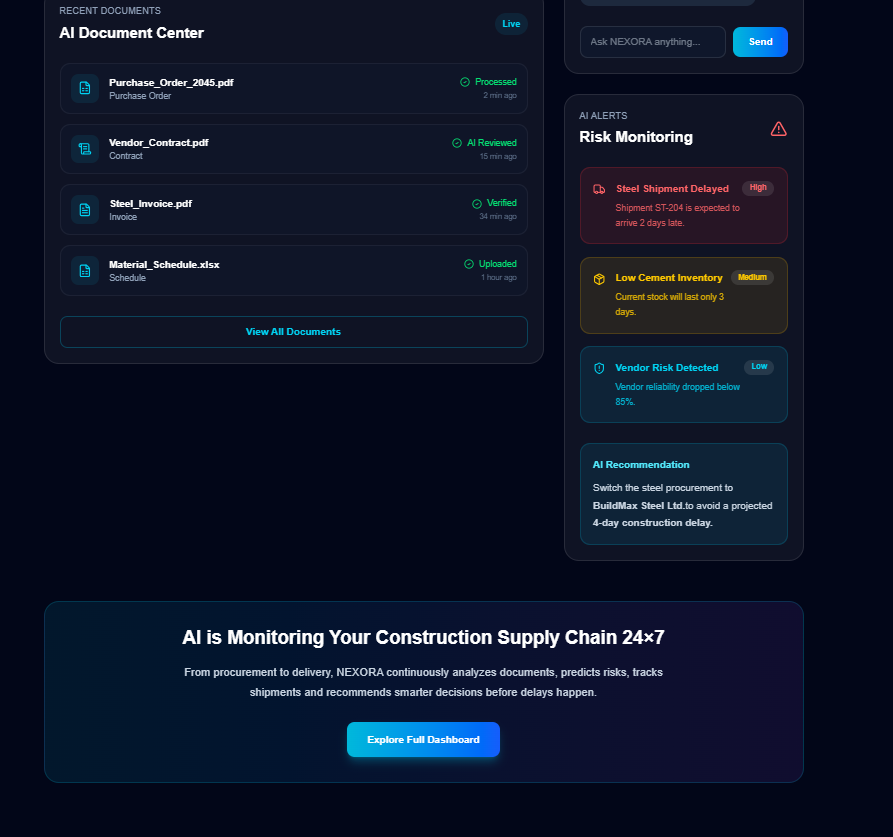
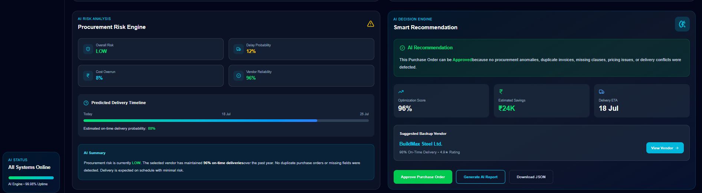
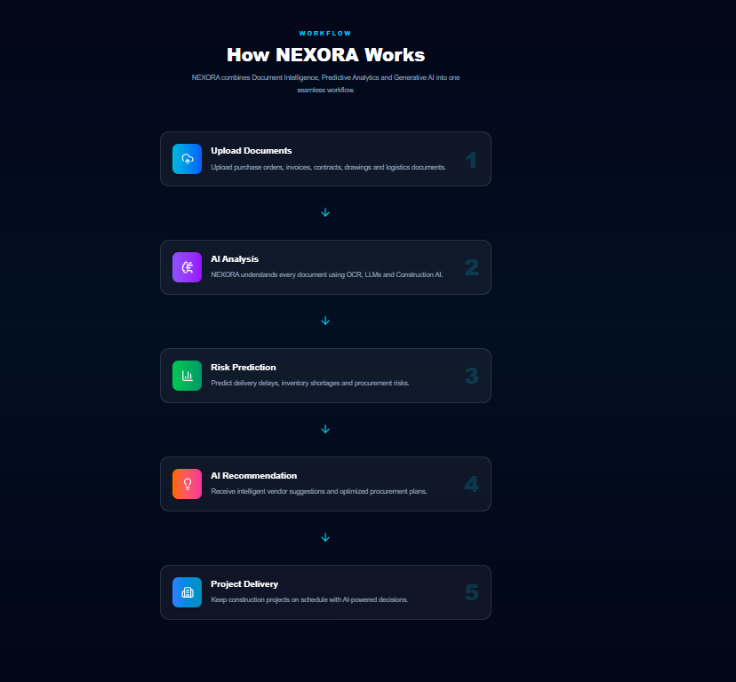
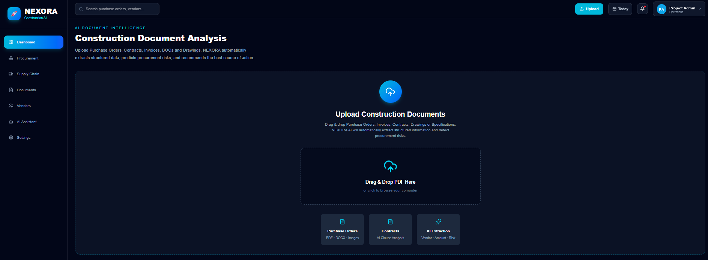
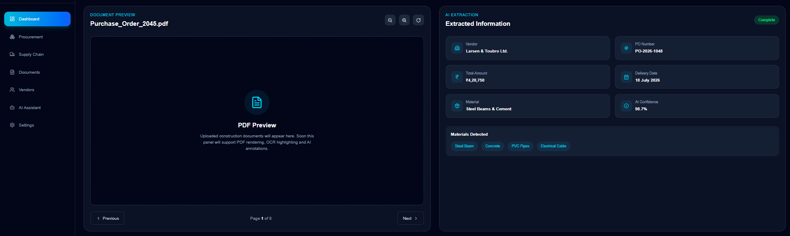
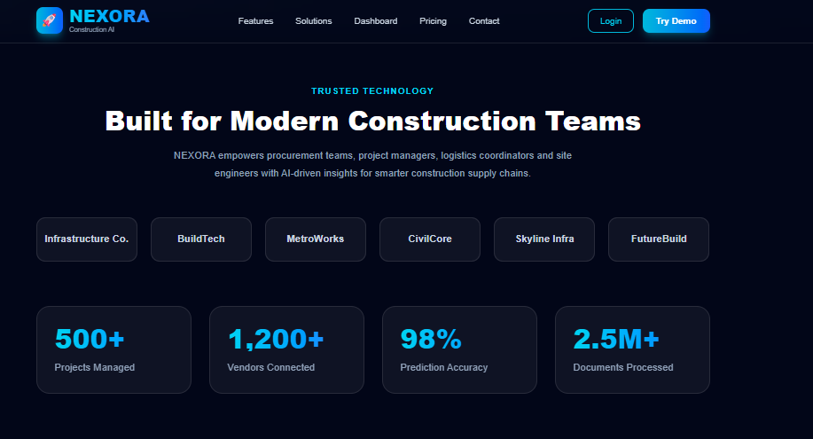
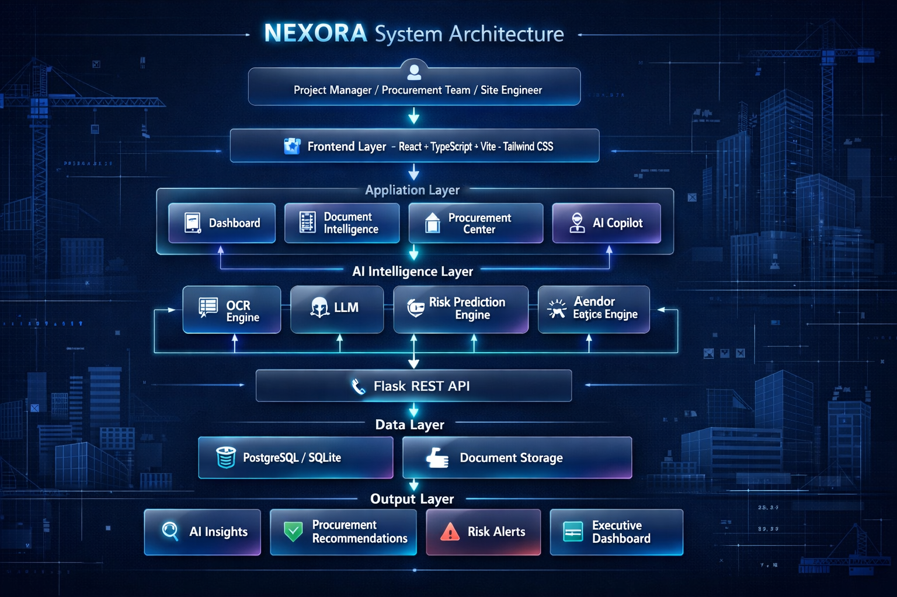

# 🚀 NEXORA

### AI-Powered Construction Supply Chain Intelligence Platform

<p align="left">
  <a href="https://nexora-virid-xi.vercel.app"></a>
  <a href="LICENSE"></a>
  
  
  
  
  
  
</p>

NEXORA is an AI-powered Construction Supply Chain Intelligence Platform that streamlines construction procurement, purchase order analysis, vendor management, and risk mitigation using Retrieval-Augmented Generation (RAG), FAISS vector search, and cloud LLMs.

---

## 🌐 Live Demo

**[Visit NEXORA Live →](https://nexora-virid-xi.vercel.app)**

Production Deployment: **https://nexora-virid-xi.vercel.app**

The NEXORA web interface is deployed live on Vercel with optimized production asset bundling and continuous deployment.

<p align="center">
  
</p>

---

## 📖 Overview

NEXORA empowers construction project managers, procurement directors, and supply chain leads with real-time actionable intelligence:

- **Construction Procurement Intelligence**: Automated tracking and analytical aggregation of procurement cycles, budget burn rates, and delivery milestones.
- **Purchase Order Analysis**: Automated parsing and validation of purchase orders, item specifications, quantities, and pricing against contractual baselines.
- **Supply-Chain Monitoring**: Live tracking of material shipments, dispatch status, carrier transit times, and delivery schedule compliance.
- **Vendor Intelligence**: Multi-dimensional supplier evaluation, performance scoring, reliability ratings, and risk categorizations.
- **Document Intelligence**: Instant multi-format document extraction and parsing for POs, invoices, contracts, and BOQs (PDF, DOCX, TXT).
- **Risk Detection**: Proactive anomaly and risk detection for delayed deliveries, budget variances, and vendor reliability issues.
- **RAG-Powered Document Q&A**: Domain-grounded question answering with strict anti-hallucination guardrails and context citations.
- **AI-Assisted Construction Insights**: Streaming AI assistant providing contextual synthesis and instant recommendations for complex procurement inquiries.

<p align="center">
  
</p>

---

## ✨ Features

### 📊 Dashboard
- **Construction Intelligence Overview**: High-level KPI indicators including total procurement volume, active projects, and vendor count.
- **Procurement Metrics**: Real-time spending distribution, PO fulfillment rates, and budget variances.
- **Supply-Chain Status**: Active shipment pipelines, delivery stages, and transit milestones.
- **Risk Indicators**: Categorized risk alerts for schedule bottlenecks and cost overruns.
- **AI Insights**: Contextual executive summaries highlighting urgent supply-chain priorities.

<p align="center">
  
</p>

<p align="center">
  
</p>

### 📑 Procurement
- **Purchase-Order Intelligence**: Structured tabular and card views for purchase order status, vendors, and amounts.
- **Procurement Analysis**: Deep-dive breakdowns into material categories and spending trajectories.
- **Action-Oriented Insights**: Direct status updates, filtering, and priority actions.

<p align="center">
  
</p>

### 🚚 Supply Chain
- **Shipment & Logistics Monitoring**: Tracking status (In Transit, Delivered, Delayed, Pending) across active cargo routes.
- **Delivery Visibility**: Destination site tracking, estimated vs. actual arrival dates, and carrier details.
- **Supply-Chain Intelligence**: Rapid bottleneck identification to prevent on-site construction stoppages.

<p align="center">
  
</p>

### 📄 Documents & Knowledge Base
- **Document Upload**: Drag-and-drop file uploader supporting PDF, DOCX, and TXT files.
- **Document Extraction**: Server-side text parsing with PyMuPDF and Python-docx.
- **Semantic Indexing**: Text chunking and embedding generation via Sentence Transformers.
- **FAISS Retrieval**: High-speed vector index retrieval returning the top-2 most relevant semantic chunks.
- **Document-Based Question Answering**: Grounded queries strictly answering from uploaded documentation.

<p align="center">
  
</p>

<p align="center">
  
</p>

### 🏢 Vendors
- **Vendor Intelligence**: Supplier profiles with ratings, active purchase orders, and total contracted value.
- **Vendor Metrics**: On-time delivery performance, quality compliance, and tier classifications.

<p align="center">
  
</p>

### 💬 AI Assistant
- **Natural-Language Procurement Q&A**: Conversational interface for querying procurement records, contracts, and specifications.
- **RAG-Based Answers**: Answers synthesized strictly from retrieved context chunks.
- **Source & Citation Rendering**: Expandable citation cards showing source text, document name, and chunk index.
- **Streaming Responses**: Real-time token streaming using Server-Sent Events (SSE) via `POST /ask/stream`.
- **Stop / Cancel Streaming**: User control to immediately abort active token generation.
- **Uploaded-Document Context**: Dynamic knowledge base synchronization reflecting newly uploaded documents.

---

## 🏗️ Architecture & Tech Stack

<p align="center">
  
</p>

```
               [ User / Browser ]
                       │
                       ▼
       [ Frontend (React + Vite + Tailwind CSS) ]
                       │
                       │ HTTPS API (VITE_API_BASE_URL)
                       ▼
             [ Flask Backend API ]
                /             \
               /               \
              ▼                 ▼
   [ FAISS Vector Store ]   [ Cloud LLM (OpenAI / OpenRouter) ]
   (Embeddings / RAG)       (Grounded Inference)
```

### Technology Stack

- **Frontend**: React 18, TypeScript, Vite, Tailwind CSS, Lucide React Icons
- **Backend**: Python 3.10+, Flask, Flask-CORS, Gunicorn
- **Vector Search & RAG**: FAISS (`faiss-cpu`), Sentence Transformers (`all-MiniLM-L6-v2`), Top-2 semantic retrieval
- **Cloud LLM**: OpenAI-compatible cloud API (OpenRouter / OpenAI, default: `openai/gpt-4o-mini`)
- **Document Processing**: PyMuPDF (`fitz`), Python-docx
- **Streaming**: Server-Sent Events (SSE) via `/ask/stream`

### Architectural Highlights

- **Pure Cloud LLM Inference**: No local LLM runtime or local GPU required. Inference connects to cloud OpenAI-compatible APIs (OpenRouter or OpenAI) using backend-only API keys.
- **Local Embedded RAG Pipeline**: Document text extraction, chunking, SentenceTransformer embeddings (`all-MiniLM-L6-v2`), and FAISS vector indexing run on the backend without incurring external embedding API costs.
- **Zero-Token Local Operations**: Health checks (`/health`), document uploads (`/upload`), document indexing (`/index`), and FAISS semantic retrieval require zero LLM tokens. Tokens are consumed only when generation is requested via `/ask` or `/ask/stream`.

---

## 🔒 Security & Data Protection

NEXORA incorporates defense-in-depth security best practices across frontend and backend:

- **Backend-Only API Key Handling**: Secrets (`OPENAI_API_KEY`) reside exclusively in backend environment variables and are never bundled, transmitted, or accessible to client-side code.
- **Environment Variable Isolation**: Configuration is managed via `.env` files with strictly templated `.env.example` files.
- **Strict Input Validation**: All user queries, upload parameters, and JSON payloads are sanitized and validated against schemas.
- **Rate Limiting**: Sliding-window in-memory rate limiting applied to generation and search endpoints to prevent abuse.
- **File Upload Validation & Magic Bytes**: Rigorous file type verification checking MIME types, file size limits (max 16MB), and binary magic-byte signatures for PDF and DOCX files.
- **Path Traversal Protection**: Secure filename sanitization using `werkzeug.utils.secure_filename` preventing directory traversal (`../`).
- **Isolated Upload Storage**: Uploaded files and vector indices are stored in dedicated directories excluded from Git tracking.
- **Safe Error Handling**: Production error responses mask internal stack traces and database schemas from external clients.
- **Zero Secrets Committed**: Git configuration excludes `.env`, vector store indices, credentials, and runtime uploads.

---

## 📱 Responsive Design

NEXORA is engineered with responsive layouts tested across multiple viewport sizes and zoom levels:
- **Desktop (1920x1080 & 1440x900)**: Multi-column grid layouts with fixed persistent sidebar navigation.
- **Laptop & Tablet (1024x768 & 768x1024)**: Adaptive card grids, scrollable data tables, and collapsible sidebar.
- **Mobile (375x667 to 414x896)**: Full-width responsive cards, stacked metrics, touch-friendly tap targets, and an animated slide-over navigation drawer.

---

## ⚙️ Environment Variables

### Backend Configuration (`backend/.env`)

| Variable | Description | Default / Example |
| :--- | :--- | :--- |
| `PORT` | Backend server port | `5000` |
| `HOST` | Backend host binding | `0.0.0.0` |
| `DEBUG` | Flask debug mode | `False` |
| `FRONTEND_URL` | Allowed CORS origins (comma-separated) | `http://localhost:5173,https://nexora-virid-xi.vercel.app` |
| `LLM_PROVIDER` | Cloud LLM provider (`openai`) | `openai` |
| `OPENAI_API_KEY` | Secret API Key (OpenAI or OpenRouter) | `sk-or-v1-...` |
| `OPENAI_BASE_URL` | API base URL (e.g. for OpenRouter) | `https://openrouter.ai/api/v1` |
| `OPENAI_MODEL` | Target LLM model identifier | `openai/gpt-4o-mini` |
| `LLM_TIMEOUT_SECONDS` | Maximum timeout per request | `60` |
| `LLM_MAX_RETRIES` | Max retries for transient errors | `2` |

> 🔒 **Security Notice**: Never put `OPENAI_API_KEY` into frontend files or version control. It is strictly kept on the Flask backend.

### Frontend Configuration (`.env`)

| Variable | Description | Default / Example |
| :--- | :--- | :--- |
| `VITE_API_BASE_URL` | Backend API URL | `http://127.0.0.1:5000` (Local) / `https://nexora-backend-two.vercel.app` (Prod) |

---

## 🚀 Installation & Local Development

### 1. Clone Repository

```bash
git clone https://github.com/mrashish18/NEXORA.git
cd NEXORA
```

### 2. Backend Setup

```bash
cd backend

# Create and activate virtual environment
python -m venv venv

# On Windows:
.\venv\Scripts\activate
# On Linux/macOS:
source venv/bin/activate

# Install dependencies
pip install -r requirements.txt

# Configure environment variables
cp .env.example .env
# Edit .env and set your OPENAI_API_KEY and model configuration

# Start backend server
python app.py
```

Backend will run on: `http://127.0.0.1:5000`

### 3. Frontend Setup

In a separate terminal:

```bash
# Return to repository root
cd ..

# Install dependencies
npm install

# Start Vite development server
npm run dev
```

Frontend will run on: `http://localhost:5173`

---

## 🔌 API Endpoints

### 1. Health Check
```http
GET /health
```
**Response:**
```json
{
  "status": "ok",
  "backend": "online",
  "service": "NEXORA RAG Engine",
  "llm": {
    "provider": "openai",
    "configured": true,
    "available": true,
    "model": "openai/gpt-4o-mini"
  },
  "knowledge_base": {
    "indexed": true,
    "chunks_count": 15
  }
}
```

### 2. Query AI Assistant (Synchronous)
```http
POST /ask
Content-Type: application/json

{
  "question": "What are the structural steel delivery requirements?"
}
```
**Response:**
```json
{
  "success": true,
  "answer": "Structural steel deliveries must arrive by 06:00 AM under supervisor signature authorization.",
  "sources": [
    "Special contract clause: Structural steel must be delivered by 06:00 AM."
  ],
  "metadata": {
    "provider": "openai",
    "model": "openai/gpt-4o-mini",
    "chunks_retrieved": 2
  }
}
```

### 3. Query AI Assistant (Streaming via SSE)
```http
POST /ask/stream
Content-Type: application/json

{
  "question": "What are the structural steel delivery requirements?"
}
```
Streams `data: {"type": "sources", "sources": [...]}` followed by `data: {"type": "token", "token": "..."}` and `data: {"type": "done"}`.

### 4. Upload Document
```http
POST /upload
Content-Type: multipart/form-data

file: <document.pdf | document.docx | document.txt>
auto_index: true
```

---

## 🧪 Testing & Verification

All test suites have been executed and verified:

### Frontend Linting & Build
```bash
# Check TypeScript & formatting
npm run lint

# Validate production build
npm run build
```
- **Lint**: `Found 0 warnings and 0 errors` (40 files analyzed)
- **Build**: Vite production bundle compiled cleanly in under 1 second

### Backend Unit Tests
```bash
python -m unittest backend/tests/test_backend.py -v
```
- **Result**: `Ran 16 tests ... OK`
- Covers health checks, RAG querying, SSE streaming, document upload, and fallback handling.

### Security Unit Tests
```bash
python -m unittest backend/tests/test_security.py -v
```
- **Result**: `Ran 9 tests ... OK`
- Validates path traversal blocking, MIME/magic byte validation, rate limiting, and safe error formatting.

---

## 📂 Project Structure

```
NEXORA/
├── backend/
│   ├── api/
│   │   └── index.py              # Vercel serverless Python entry point
│   ├── routes/
│   │   ├── upload.py             # Document upload & auto-indexing endpoints
│   │   └── rag.py                # Query (/ask, /ask/stream, /health)
│   ├── services/
│   │   ├── pdf_reader.py         # Multi-format document text extraction
│   │   ├── embeddings.py         # SentenceTransformer + FAISS vector store
│   │   ├── rag_engine.py         # Grounded prompt builder & RAG engine
│   │   ├── llm_provider.py       # Cloud LLM client (OpenAI / OpenRouter)
│   │   └── rate_limiter.py       # In-memory sliding-window rate limiter
│   ├── tests/
│   │   ├── test_backend.py       # Backend unit test suite (16 tests)
│   │   ├── test_security.py      # Security & validation test suite (9 tests)
│   │   └── verify_live_cloud_rag.py # Live cloud integration test script
│   ├── app.py                    # Flask application entry point & CORS
│   ├── config.py                 # Centralized configuration & environment loader
│   ├── requirements.txt          # Python production dependencies (CPU-optimized)
│   ├── vercel.json               # Backend Vercel serverless deployment config
│   └── .env.example              # Backend environment template
├── docs/                         # Architecture diagrams & application screenshots
├── public/                       # Static web assets
├── src/                          # React + TypeScript frontend
│   ├── components/               # UI components (ChatPreview, Sidebar, UploadZone)
│   ├── hooks/                    # Custom React hooks (useBackendHealth)
│   ├── pages/                    # Application pages (Dashboard, POs, Vendors, Documents)
│   ├── services/
│   │   └── api.ts                # Centralized API client (streaming & sync)
│   ├── types/                    # TypeScript interfaces & API contracts
│   ├── App.tsx                   # Main layout and routing
│   ├── index.css                 # Tailwind CSS styling and theme
│   └── main.tsx                  # Application entry point
├── .gitignore                    # Git ignore specifications
├── index.html                    # Single-page application HTML entry
├── package.json                  # Node.js dependencies and scripts
├── README.md                     # Platform documentation
├── tsconfig.json                 # TypeScript compiler configuration
├── vercel.json                   # Frontend Vercel SPA routing rewrite rules
└── vite.config.ts                # Vite build and development configuration
```

---

## 🌐 Production Deployment

NEXORA is fully deployed in production on Vercel across two dedicated projects:

| Component | Platform | Production URL | Status |
| :--- | :--- | :--- | :--- |
| **Frontend UI** | Vercel SPA | [https://nexora-virid-xi.vercel.app](https://nexora-virid-xi.vercel.app) | 🟢 Live & Connected |
| **Backend API** | Vercel Serverless (Python/Flask) | [https://nexora-backend-two.vercel.app](https://nexora-backend-two.vercel.app) | 🟢 Live & Operational |

### Verified Production Endpoints
- **Health Check**: `GET https://nexora-backend-two.vercel.app/health` → `{"status": "ok", "backend": "online"}`
- **RAG Inference**: `POST https://nexora-backend-two.vercel.app/ask` → Grounded answers with citations
- **SSE Streaming**: `POST https://nexora-backend-two.vercel.app/ask/stream` → Real-time token streaming
- **Document Upload**: `POST https://nexora-backend-two.vercel.app/upload` → Multi-format parser & auto-indexing
- **Indexing**: `POST https://nexora-backend-two.vercel.app/index` → FAISS vector index updates

### Serverless Vector Store Persistence Note
In serverless execution environments such as Vercel:
- Runtime document uploads and dynamic vector indices are written to `/tmp` (ephemeral container storage allocated per instance).
- On cold starts, the system falls back seamlessly to the bundled base knowledge base index.
- For permanent cross-session storage across serverless instances in high-concurrency production deployments, an external managed vector store (e.g., Pinecone, Qdrant, or Supabase pgvector) or cloud object storage (S3 / GCS) can be configured.

---

## 📄 License

This project is licensed under the MIT License - see the [LICENSE](LICENSE) file for details.